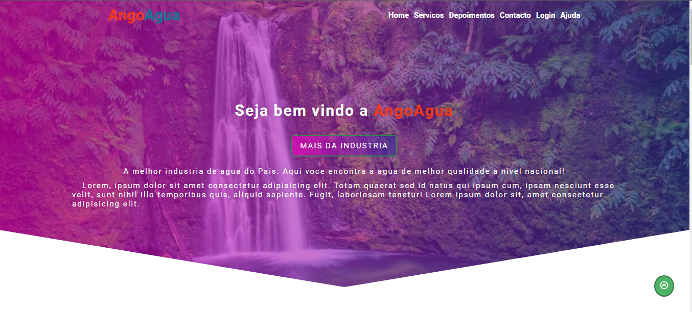
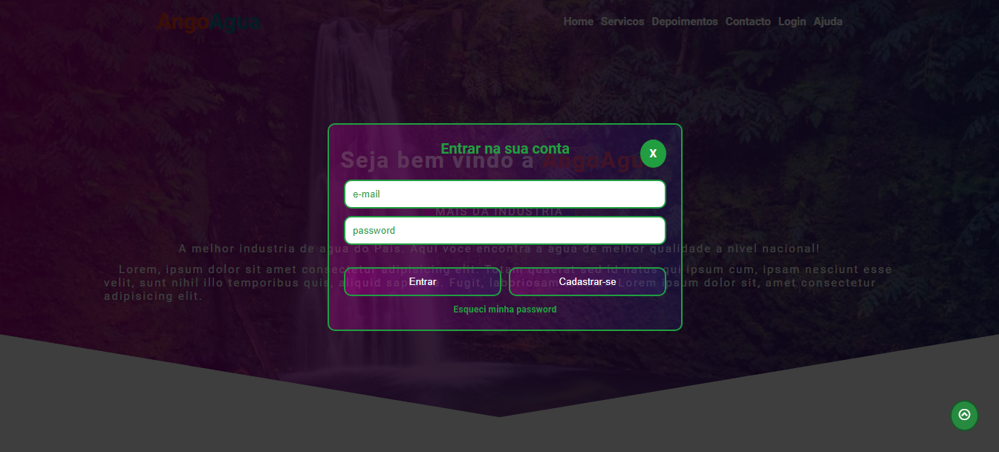
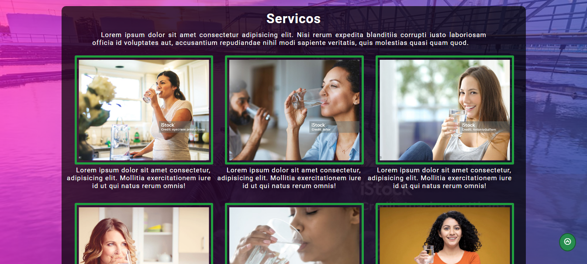
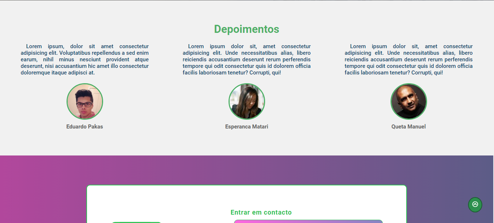
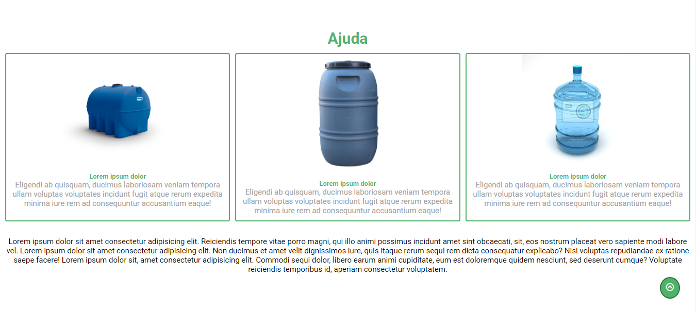
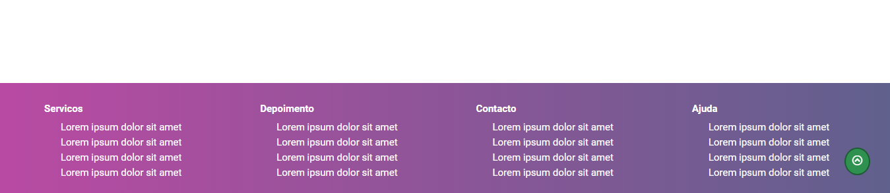

# AngoAgua

### Industria de Agua

## Techs usadas
- HTML5
- CSS3
- JavaScript
- SASS

    
Um website de uma industria de agua, com um front end completo e animado, com tratamento dos dados inseridos no formulario.

    
A fins didaticos, o website foi construido para passar dicas

    <h2>Fotos</h2>
    

      
      
      
      
      
      
      
    

